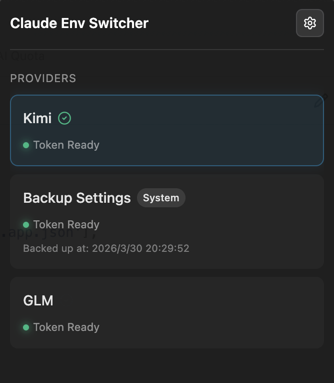

# 🎭 Claude Env Manager

An elegant, native macOS menubar application designed to hot-switch environment variable configurations for [Claude Code](https://docs.anthropic.com/en/docs/agents-and-tools/claude-code/overview). Manage multiple model provider setups and instantly swap between them with a single click right from your status bar.



## ✨ Features

- **Mac-Native Experience**: Runs cleanly in the background with a polished dark-glassmorphic UI and a custom Template icon that seamlessly adapts to your system's Dark/Light themes.
- **Dynamic JSON Configurations**: Forget rigid forms. Input and edit your environment states as raw JSON payloads (`{"env": {...}}`).
- **Fail-Safe Switch & Backup**: 
  - Automatically captures the live `~/.claude/settings.json` state immediately *before* performing any switch, saving an immutable **Backup Config** directly in your Provider list. If anything breaks, standardizing on the Backup permanently restores your prior working state effortlessly.
  - Zero-overwrites on core CLI settings. It strictly replaces the `"env"` layer logic in the target background file and preserves every other plugin and marketplace configuration exactly as-is.
- **Safety Validations**: Rejects environments missing appropriate `ANTHROPIC_AUTH_TOKEN` entries to ensure your active environment never gets disabled accidentally by an empty form payload.

## 🚀 Getting Started

1. Clone this repository
2. Install dependencies:
   ```bash
   npm install
   ```
3. Run locally:
   ```bash
   npm run dev
   ```
4. Build binary distributables:
   ```bash
   npm run build
   ```

## 🛠 Tech Stack

Built solidly on top of **Electron**, **Vite**, and **React** with a completely un-styled pure vanilla CSS architectural skeleton optimized for native `-webkit-app-region` implementations. Variables and persistent settings handled gracefully via `electron-store`.
